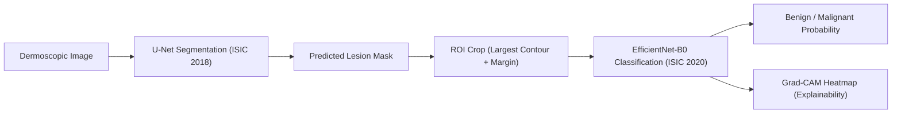

# Skin Cancer Detection Project (Professor Viva Guide)

## 1. Pipeline Diagram

**Flow (one-line):**  
`Image -> Segmentation (U-Net) -> ROI Crop -> Classification (EfficientNet-B0) -> Prediction + Grad-CAM`

---

## 2. Final Results Summary

> ### Final Results Summary
> - **Segmentation Dice Score:** ~0.85  
> - **ROI Model ROC-AUC:** ~0.88  
> - **Full Image ROC-AUC:** ~0.86  
> - **Key Insight:** ROI-based classification improves performance over full-image classification.
>
> **Note:** These are current experimental values and should be updated after the final full run.

---

## 3. Part A: Cheat Sheet (2-Minute Viva Version)

## Project in 6 lines
1. We first train a **U-Net** model on ISIC 2018 to segment lesion regions.
2. We use that segmentation model to generate lesion masks for ISIC 2020 images.
3. From each mask, we crop a focused **ROI lesion patch**.
4. We train **EfficientNet-B0** classifier on these ROI crops for benign vs malignant prediction.
5. We evaluate with medical-relevant metrics, especially **ROC-AUC**.
6. We use **Grad-CAM** to explain why the classifier predicted a class.

## File-by-file roles
- `config.py`: All dataset paths, hyperparameters, output folders, and toggles.
- `dataset.py`: Dataset classes for ISIC 2018 and ISIC 2020, with missing-file-safe logic.
- `model_unet.py`: U-Net architecture and Dice loss implementation.
- `utils.py`: Seed setup, transforms, metrics, ROI crop logic, confusion matrix, Grad-CAM helpers.
- `train_segmentation.py`: Train U-Net, early stopping, save `.pth`, generate ROI crops + manifest.
- `train_classification.py`: Train EfficientNet-B0, class imbalance handling, metrics, Grad-CAM, comparison.

## Key features used (say this clearly in viva)
- **BCE + Dice combined loss** for segmentation.
- **Train/validation split** for segmentation and classification.
- **Early stopping** to prevent overfitting.
- **ROC-AUC** included as primary medical metric.
- **Class imbalance handling** via `WeightedRandomSampler` (+ optional `pos_weight`).
- **Explainability** via Grad-CAM.
- **Reproducibility** via fixed seed.
- **Portable model saving** via `.pth` state_dict files.

## 45-second opening script
“This project improves skin cancer detection by combining segmentation and classification.  
First, U-Net identifies lesion regions from dermoscopic images. Then we crop ROI around lesions and train EfficientNet-B0 for benign/malignant prediction.  
This ROI-focused strategy improves ROC-AUC compared to full-image classification.  
We also ensure reproducibility, robust error handling, and explainability using Grad-CAM.”

---

## 4. Part B: Technical Report (Detailed)

## 4.1 Problem Statement
Skin lesion classification is difficult because lesions occupy only part of the image and background artifacts can distract the model.  
So instead of directly classifying full images, this project first segments lesion regions and then classifies cropped lesion ROIs.

## 4.2 Why This Project Matters
Skin cancer detection is critical because early diagnosis significantly improves survival rates.  
This project improves detection reliability by focusing on lesion regions instead of full images.

## 4.3 Datasets and Targets
- **ISIC 2018 (Segmentation)**
  - Input: dermoscopic images
  - Target: binary lesion mask
- **ISIC 2020 (Classification)**
  - Input: dermoscopic image
  - Target: `target` column (0 = benign, 1 = malignant)
  - Filename key: `isic_id`

## 4.4 Configuration and Reproducibility
From `config.py`:
- Centralized paths for ISIC 2018 and ISIC 2020.
- Runtime hyperparameters:
  - `IMAGE_SIZE = 224`
  - `BATCH_SIZE = 8`
  - `LR = 3e-4`
  - `EPOCHS`, `PATIENCE`, `NUM_WORKERS = 0`
  - `LIMIT` for low-RAM subset mode.
- Device selection (`cuda` if available).

Reproducibility:
- `set_seed(SEED)` sets Python, NumPy, and PyTorch seeds.
- CUDA deterministic settings are enabled for consistent runs.

## 4.5 Data Pipeline and Preprocessing
Transforms use Albumentations:
- Resize to `224 x 224`.
- Augmentations:
  - horizontal/vertical flips
  - rotation
  - brightness/contrast
- Normalize using ImageNet stats:
  - mean `(0.485, 0.456, 0.406)`
  - std `(0.229, 0.224, 0.225)`

Why normalize?
- EfficientNet-B0 pretrained weights expect ImageNet-like normalized input.
- Improves convergence stability and final performance.

## 4.6 Segmentation Model: U-Net
Implemented from scratch in `model_unet.py`:
- `DoubleConv` block (Conv + BN + ReLU repeated).
- Encoder path to capture context.
- Bottleneck to learn compact semantic features.
- Decoder path with transpose convolution + skip connections.
- Final 1-channel logits output.

Skip connections preserve spatial detail, which is very important for accurate mask boundaries.

## 4.7 Segmentation Loss (Default = BCE + Dice)
In `train_segmentation.py`:
- `BCEWithLogitsLoss` for pixel-wise classification.
- `DiceLoss` for overlap quality.
- Total loss:

\[
\mathcal{L}_{total} = \mathcal{L}_{BCE} + \mathcal{L}_{Dice}
\]

Dice intuition:

\[
Dice = \frac{2|P \cap G| + \epsilon}{|P| + |G| + \epsilon}
\]

where \(P\) is predicted mask and \(G\) is ground truth mask.

Why combine?
- BCE improves pixel accuracy.
- Dice improves region overlap and is robust to class imbalance in masks.

## 4.8 Segmentation Training Strategy
- Explicit train/validation split using `train_test_split`.
- Per-epoch logging:
  - total train loss
  - BCE component
  - Dice component
  - validation Dice score
- Early stopping based on validation loss.
- Checkpoints:
  - `unet_last.pth`
  - `unet_best.pth`

State_dict usage statement for report:
“Model weights were saved using PyTorch’s state_dict format (`.pth`) for portability and reproducibility.”

## 4.9 ROI Crop Generation from Masks
After training U-Net:
1. Predict mask for each ISIC 2020 image.
2. Threshold mask probabilities.
3. Find largest contour.
4. Build bounding box + margin.
5. Crop lesion ROI and save.

Failure handling:
- If mask is empty or no contour is found, fallback to center crop.

Artifacts:
- ROI images saved in output crop folder.
- `roi_manifest.csv` logs status per image.

## 4.10 Classification Model: EfficientNet-B0
In `train_classification.py`:
- Load pretrained EfficientNet-B0.
- Replace final classification head with binary output (1 logit).
- Loss: `BCEWithLogitsLoss`.

Class imbalance handling:
- `WeightedRandomSampler` in DataLoader.
- Optional positive class weight (`pos_weight`) in loss.

## 4.11 Classification Metrics (Medical Focus)
Computed per validation run:
- Accuracy
- Precision
- Recall
- F1 Score
- **ROC-AUC** (most important for ranking quality in medical binary classification)

Why ROC-AUC is critical:
- It evaluates separability across thresholds, not only at one fixed threshold.

## 4.12 Confusion Matrix Interpretation
Confusion matrix plots are generated and saved.  
What to discuss:
- True positives: correctly detected malignant cases.
- False negatives: dangerous misses (most critical error clinically).
- False positives: extra alarms (less severe than missed cancer).

## 4.13 Explainability with Grad-CAM
Grad-CAM is generated for classifier outputs:
- Captures feature maps and gradients from the last conv stage.
- Produces a heatmap showing which regions most influenced prediction.

Viva point:
“Grad-CAM helps us verify the model is focusing on lesion-relevant regions, improving trustworthiness.”

## 4.14 Comparison Study: Full Image vs ROI
This project supports two experiments:
1. Classifier trained on ROI crops (segmentation-assisted).
2. Baseline classifier trained on full images.

A comparison CSV is saved with side-by-side metrics.  
Main expected insight: ROI-based classification performs better because lesion-focused input reduces background noise.

## 4.15 Engineering Design for Laptop Constraints
- Small batch sizes.
- `num_workers = 0` for Windows compatibility.
- `LIMIT` mode to train on subset (for low RAM / quick debug).
- Missing file checks and safe fallback logic in datasets and crop stage.
- Logging instead of noisy prints for clean debugging traces.

## 4.16 Runbook (Exact Order)
1. Update paths in `config.py`.
2. Run segmentation and ROI generation:
   - `python train_segmentation.py`
3. Run classification experiments:
   - `python train_classification.py`

Expected outputs:
- `checkpoints/*.pth`
- `outputs/roi_crops/*`
- `outputs/reports/roi_manifest.csv`
- `outputs/reports/comparison_metrics.csv`
- `outputs/figures/confusion_matrix_*.png`
- `outputs/figures/gradcam_*.png`

---

## 5. Viva Q&A (Likely Questions + Strong Answers)

1. **Why did you use segmentation before classification?**  
Because lesions are often small relative to full image; segmentation isolates lesion and reduces background noise for classifier.

2. **Why U-Net for segmentation?**  
U-Net is a standard medical segmentation architecture with skip connections that preserve boundary details.

3. **Why combine BCE and Dice loss?**  
BCE improves pixel-wise learning; Dice optimizes overlap. Combined loss performs better for imbalanced mask learning.

4. **Why EfficientNet-B0?**  
Good accuracy-efficiency tradeoff for laptop hardware and transfer learning.

5. **Why is ROC-AUC important here?**  
In medical binary tasks, threshold-independent discrimination quality is critical; ROC-AUC captures this better than accuracy alone.

6. **How did you handle class imbalance?**  
Weighted sampler for batches and optional positive class weighting in BCE loss.

7. **How did you avoid overfitting?**  
Validation split, data augmentation, and early stopping based on validation loss.

8. **How do you ensure reproducibility?**  
Fixed random seed across Python/NumPy/PyTorch and deterministic CUDA settings.

9. **How are models saved?**  
With `.pth` state_dict files, which are portable and standard in PyTorch.

10. **What if segmentation fails for an image?**  
Fallback center crop is applied so pipeline remains robust.

11. **How do you verify model is not cheating on background?**  
Grad-CAM heatmaps to inspect attention regions.

12. **What is the biggest clinical risk in your classifier?**  
False negatives (missing malignant lesions). That is why recall and confusion matrix are carefully monitored.

13. **What does `roi_manifest.csv` provide?**  
Traceability of ROI generation status for each image (success/fallback/skip).

14. **Why use ImageNet normalization?**  
EfficientNet pretrained backbone expects it; improves optimization.

15. **How would you improve this project further?**  
Cross-validation, stronger segmentation backbones, calibration, external dataset validation, and threshold optimization.

---

## 6. Limitations + Future Work

## Current limitations
- Results are from current experimental setup; broader validation is needed.
- Single backbone choice (EfficientNet-B0) may not be optimal for all settings.
- Center-crop fallback may miss lesion in rare edge cases.
- No hospital deployment calibration or prospective clinical testing.

## Future improvements
- K-fold cross-validation for stronger evidence.
- Test additional backbones and ensemble methods.
- Threshold tuning to optimize sensitivity for malignant detection.
- Use uncertainty estimation for safer decision support.
- Validate on external cohorts and different acquisition devices.
- Add clinical metadata fusion (age, sex, lesion site) where available.

---

## Final one-line conclusion for viva
This project demonstrates that **segmentation-guided ROI classification** is a practical and explainable strategy that can improve skin cancer prediction quality compared to full-image classification, while remaining reproducible and laptop-friendly.
