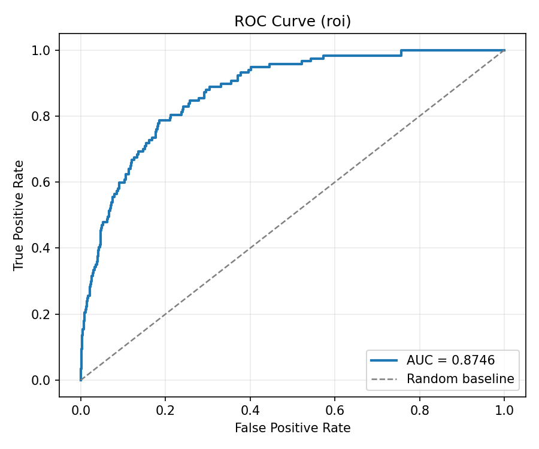
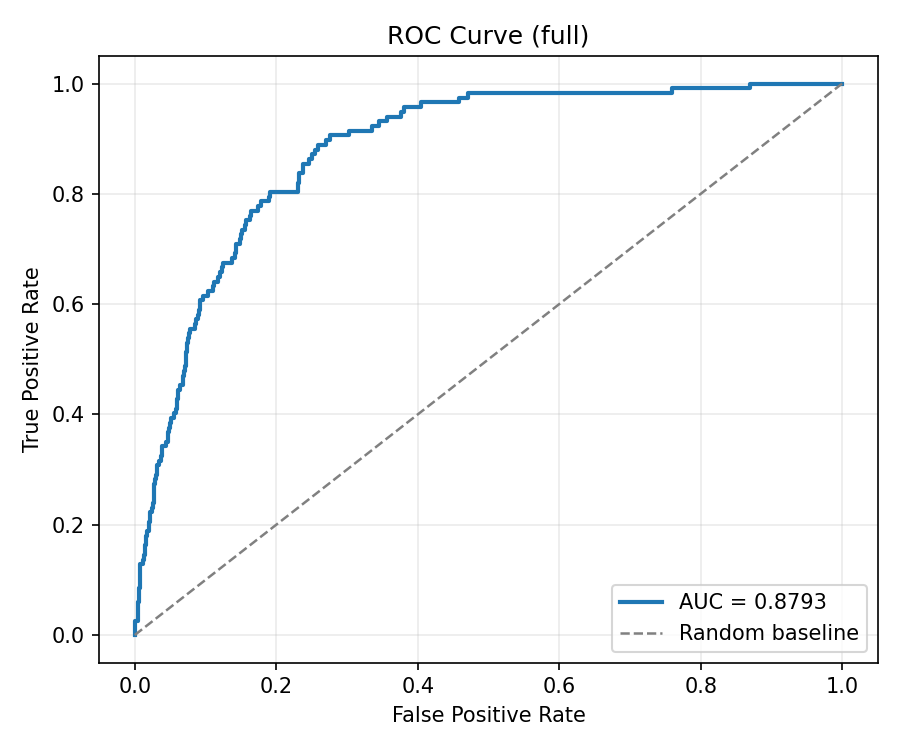
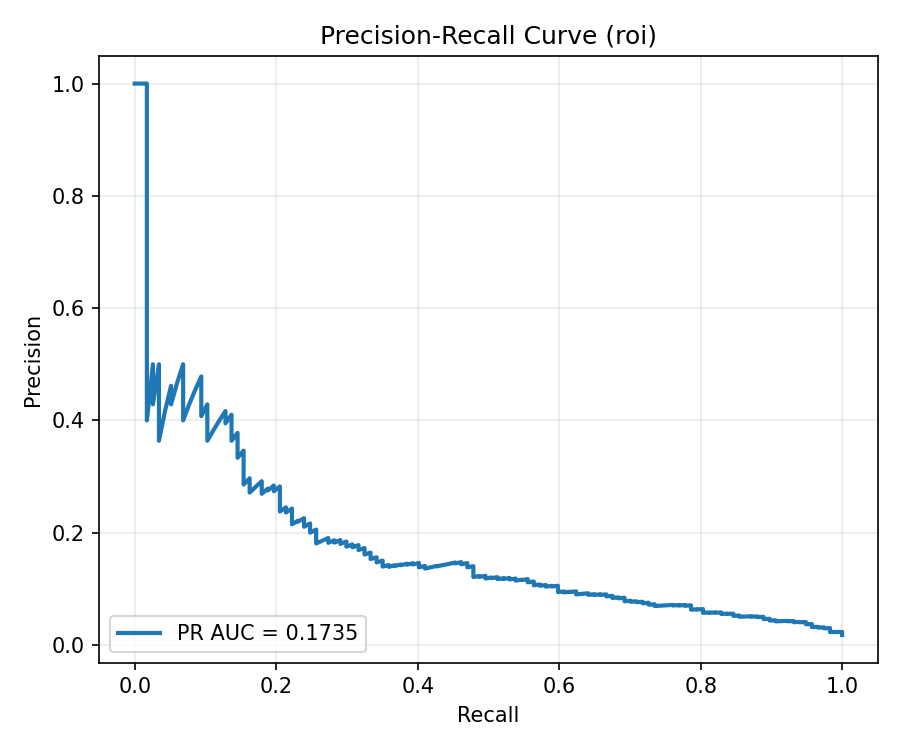
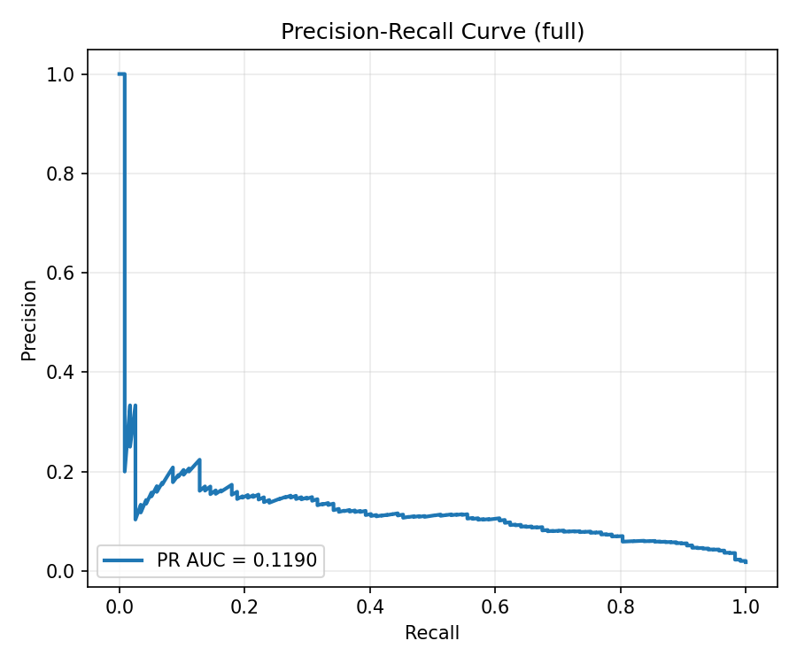
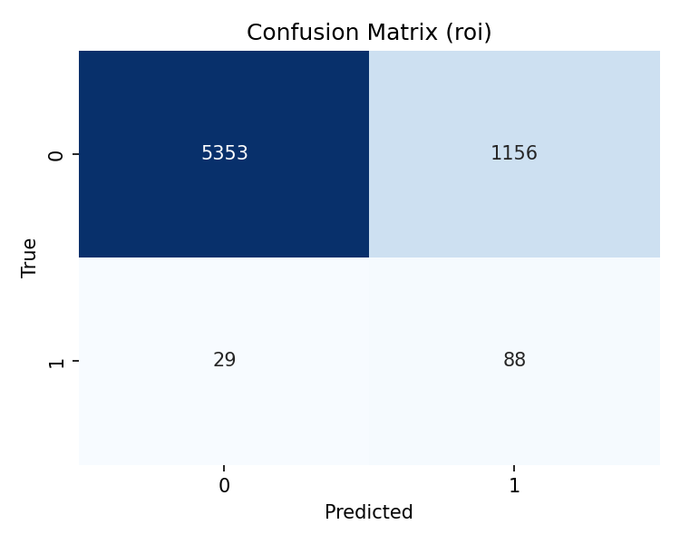
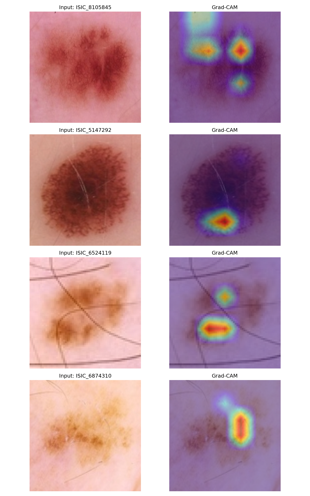
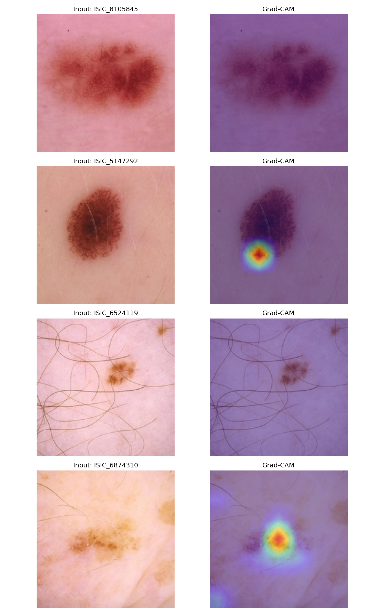

# Skin Cancer Detection using Segmentation + Classification

## 🌐 Live Demo
👉 https://skin-cancer-detection-saurabh.streamlit.app


---

## 🧠 Overview

End-to-end deep learning pipeline for skin lesion analysis:

`Image → Segmentation → ROI → Classification → Prediction + Grad-CAM`

---

## 🎯 Demo Features

- Upload dermoscopic image
- ROI vs Full-image prediction
- Grad-CAM visualization
- Real-time inference

---

## 📊 Results

| Model | Dice Score | ROC-AUC |
|------|-----------|--------|
| U-Net (Segmentation) | ~0.85 | — |
| ROI Classifier | — | 0.8746 |
| Full Image Classifier | — | 0.8793 |

---

## ⚠️ Key Insights

- Full-image model slightly outperforms ROI model
- ROI improves interpretability (better Grad-CAM focus)
- Class imbalance affects precision

---

## 🔍 Visual Results

### ROC Curve
| ROI Model | Full Model |
|----------|------------|
|  |  |

### Precision-Recall Curve
| ROI Model | Full Model |
|----------|------------|
|  |  |

### Confusion Matrix
| ROI Model | Full Model |
|----------|------------|
|  |  |

### Grad-CAM
| ROI Model | Full Model |
|----------|------------|
|  |  |

---

## 🚀 Run Locally

```bash
pip install -r requirements.txt
streamlit run app.py
